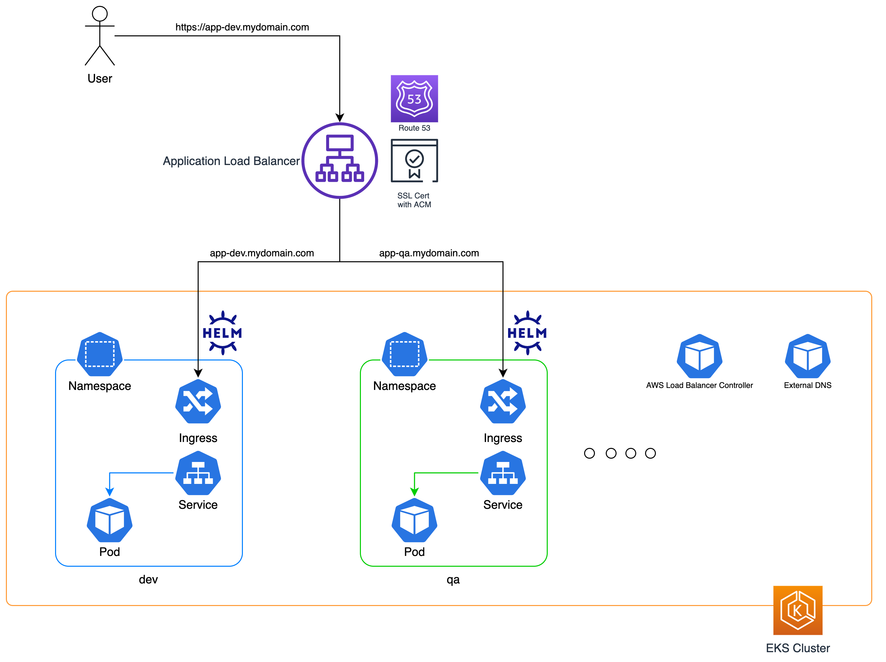
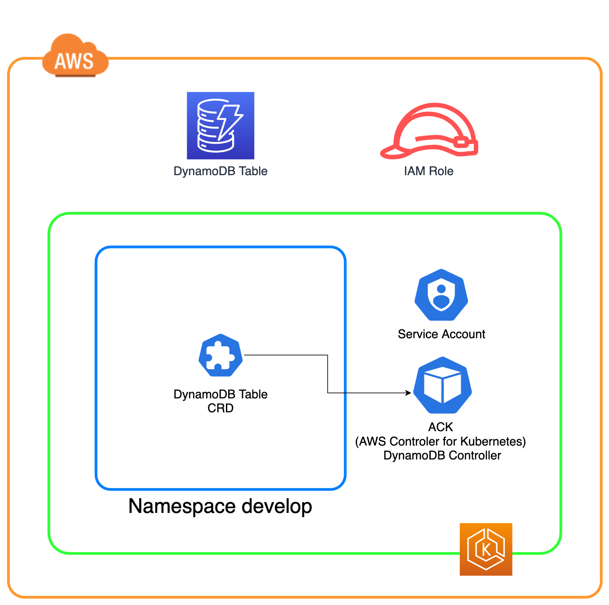

# How to create multiple environments

This solution demonstrate how you can create multiple environments on an app With the help of EKS, Helm, IAM Role for Service Accounts, External-DNS, ACM, and the AWS Load Balancer Controller.

## Prerequisites
- An AWS Account and access to it with enough required permissions _(EKS, VPC, EC2, IAM, Route53, ACM)_
- A public hosted zone on Route53 managing a valid subdomain
- A valid SSL Certificate registered in [ACM](https://aws.amazon.com/certificate-manager/) (can be the public one which is free). This one should wrap the wildcard `*.{your-domain-in-here}` (for example: `*.mariomerco.com`).
- Make sure you change the `AWS_REGION` variables in this repository to where you want to deploy the stack. The variable is present in these files:
    - cluster.yaml
    - ack/ack-dynamodb/run.sh

## Tools used
- [kubectl](https://kubernetes.io/docs/tasks/tools/)
- [eksctl](https://eksctl.io/)
- [helm](https://helm.sh/)
- [AWS CLI](https://aws.amazon.com/cli/)


## Architecture overview



## Prerequisite Guide

### 1. Create EKS Cluster

Please, follow this guide to ensure you have everything set as the baseline to use the solution.

> If you already have a Kubernetes cluster with version v1.18 or greater, please make sure the subnets where you want to publish the load balancer are tagged accordingly as the documentation explains https://kubernetes-sigs.github.io/aws-load-balancer-controller/v2.2/deploy/subnet_discovery/. Also, configure the [OIDC provider](https://docs.aws.amazon.com/eks/latest/userguide/enable-iam-roles-for-service-accounts.html)

The simpliest way to create a fully functioning EKS cluster is using **eksctl**. In this repo you can find a `cluster.yaml` file that will create the cluster for you with the Kubernetes version v1.21 and with 3 spot instances as the worker nodes, for cost savings. But you can come with whatever configuration works for you, so please take a look at the [**eksctl site**](https://eksctl.io) to customize your cluster as you want. This config file will create everything it'll need (from the VPC, including the OIDC provider required for giving authentication to the apps, etc).

You can also use the `create-cluster.sh` file to run this very quick. Take a look at it.

After it creates, test your configuration running a simple command like `kubectl get nodes` to make sure you have connectivity to the cluster.

### 2. Install ExternalDNS

[ExternalDNS](https://github.com/kubernetes-sigs/external-dns) is the tool that will be installed in the Kubernetes cluster and will listen to services and ingresses with certain configuration and create DNS records to IPs or Load Balancers (for more details, please refer to the documentation). 

In the `/external-dns` folder you'll find three files:

1. **external-dns.yaml** A preconfigured YAML that you just have to apply to your cluster to install ExternalDNS.
2. **iam.json** A CloudFormation template with the IAM Policy required to be assigned to the Role via [`IAM Role for Service Accounts`](https://docs.aws.amazon.com/eks/latest/userguide/iam-roles-for-service-accounts.html).
3. **run.sh** A bash script that will deploy the CloudFormation stack of the IAM policy, then use `eksctl` to create the [IAM Service Account](https://eksctl.io/usage/iamserviceaccounts/), and finally deploy the external-dns.yaml (The name of the service account is _external-dns_ which is specified in the YAML and in the _eksctl_ command).

> For the lab, please use the `run.sh` file to create and install everything required.

To verify it is running, please check the **ext-dns** pod in the **default** namespace with the command `kubectl get pods | grep external-dns`.

### 3. Install the AWS Load Balancer Controller

[AWS Load Balancer Controller](https://kubernetes-sigs.github.io/aws-load-balancer-controller/v2.2/) is an open source project built by AWS to enable automation provisioning of Load Balancers in AWS based on services and ingresses with certain configuration (for more details, please refer to the documentation). 

In the `/aws-load-balancer-controller` folder you'll find two files:

1. **iam.json** A CloudFormation template with the IAM Policy required to be assigned to the Role via [`IAM Role for Service Accounts`](https://docs.aws.amazon.com/eks/latest/userguide/iam-roles-for-service-accounts.html).
2. **run.sh** A bash script that will deploy the CloudFormation stack of the IAM policy, then use `eksctl` to create the [IAM Service Account](https://eksctl.io/usage/iamserviceaccounts/), and finally uses `kubectl` and `helm` to install the CRDs ([Custom Resource Definitions](https://kubernetes.io/docs/concepts/extend-kubernetes/api-extension/custom-resources/)) and the Helm Chart of the solution, respectively.

> For the lab, please use the `run.sh` file to create and install everything required.

To verify it is running, please check the **ext-dns** pod in the **default** namespace with the command `kubectl get pods --namespace kube-system | grep aws-load-balancer-controller`.


## Start creating environments!

Now that you have everything ready, let's get the hands dirty!

Please, follow the example that is under the `/helm` folder. This sample app an nginx site without any custom configuration running on a Docker container and managed by a **Deployment** object (`/helm/templates/deployment.yaml`). There's a **Service** in front of it (`/helm/templates/service.yaml`) and the **Ingress** (`/helm/templates/ingress.yaml`) with all the annotations required for it to be processed by the _AWS Load Balancer Controller_. 

There's also a `run.sh` which recieves the "name" of the environment as parameter and creates a **Namespace** with that name, plus adds it as suffix to the subdomain of the app, for example **app-dev.mariomerco.com**, where the "name" and the **Namespace** is **dev**.

> **Important Note**: Please change the `baseDomain` in the `values.yaml` file with your own DNS domain.

## Want to add a database to the mix?

We can also extend this to microservices using databases. In this repository you can find an example with a simple microservice that implements an API that interacts with DynamoDB. So each environment should have its own DynamoDB table and **[AWS Controller for Kubernetes]**(https://github.com/aws-controllers-k8s/community) can help us here creating the table directly from Kubernetes, or **ACK** for short.

This project is a set of controllers, each of them for each of the [AWS services supported so far](https://aws-controllers-k8s.github.io/community/docs/community/services/). In this case we are using the [**DynamoDB Controller**](https://github.com/aws-controllers-k8s/dynamodb-controller).


> **Important!** to follow this guideline is important you have **Helm** `v3.7` or greather installed. No, not 3.6, lol.
> **Important number 2**: Please change the `baseDomain` in the `ack/sample-microservice/helm/values.yaml` file with your own DNS domain.



1. Change Directory to the ACK DynamoDB folder in this repo (`cv ack/ack-dynamodb`) and in the `./run.sh` script, first, change the _AWS_REGION_ to the one you are using, then execute it. This script will create the IAM Role for Service Account stack for the controller (giving it permissions to DynamoDB), then downloading the latest Helm Chart of the DynamoDB Controller into your local path `/tmp/chart`, and finally install it in your Kubernetes cluster.

2. Go to the folder `ack/sample-microservice/cloudformation` and run the `./run.sh` command in here, which will create the IRSA for the Service API (our microservice). This will give dynamoDB permissions to the microservices. Why we are creating two? one for the controller (which can CreateTable), and another for the application itself (and it can be as restrictive as you need it). So just keep in mind that you could use only one, but in this way you have control over **who can do what**.

3. And from here you can start creating instances of the **Service API Microservice** going to the path `ack/sample-microservice/helm` and running the _create.sh_ command with the name of the environment as an argument, like this `/create.sh develop`, where `develop` is the name of the environment in our case.

After it finishes, you'll be able to do two things

1. To verify that the DynamoDB table was created on your account and region you've been using. The name of the table is `${Environment}-services`, where `${Environment}` is the argument you use when creating the stack, in our case `develop`.

2. To hit your microservice with the following HTTP endpoints:

- **_/create_**: Creates an item in the DynamoDB table with the following schema:
```
{
	"ServiceName": "EKS",
	"ServiceGroup": "2020",
	"HasFreeTier": false
}
```


- **_/list_**: Lists all the items created in the table so far!

## Teardown!

Is **VERY IMPORTANT** that you clean your stack after creating all of this (where you used EKS clusters, EC2 instances, DynamoDB Tables, Load Balancers, Target Groups, IAM Roles, etc), otherwise you might be charged for unused resources in your account. That why you can find a `delete.sh` in the root of this repository with a _helper_ to delete everything. Depending on what you created, you'll be able to extract the portion of code to run the deletion of all of this.
